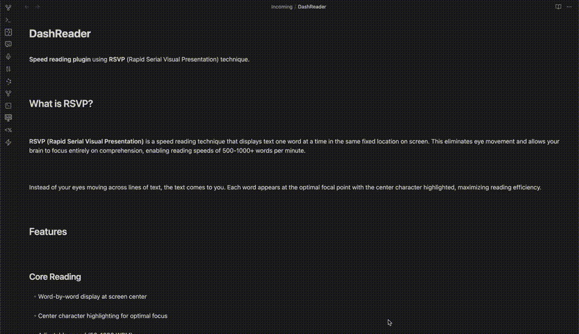

# DashReader

**Speed reading plugin** using **RSVP** (Rapid Serial Visual Presentation) technique.



## What is RSVP?

**RSVP (Rapid Serial Visual Presentation)** is a speed reading technique that displays text one word at a time in the same fixed location on screen. This eliminates eye movement and allows your brain to focus entirely on comprehension, enabling reading speeds of 500-1000+ words per minute.

Instead of your eyes moving across lines of text, the text comes to you. Each word appears at the optimal focal point with the center character highlighted, maximizing reading efficiency.

## Features

### Core Reading
- Word-by-word display at screen center
- Center character highlighting for optimal focus
- Adjustable speed (50-1000 WPM)
- Multi-word chunks (1-5 words at a time)
- Context display (surrounding words preview)

### Intelligent Pacing
- **Slow start** - gradual speed increase over first 5 words to ease into reading
- **Smart micropauses** based on content type, punctuation, word length, and structure
  - Sentence-ending punctuation (.,!?): 2.5x delay
  - Other punctuation (;:,): 1.5x delay
  - Numbers and dates: 1.8x delay
  - Long words (>8 chars): 1.4x delay
  - Paragraph breaks: 2.5x delay
- **Heading-aware pauses** - longer pauses before H1 (2x), H2 (1.8x), H3 (1.5x), etc.
- **Callout-aware pauses** - visual separator and 2x delay for Obsidian callouts
- **Progressive acceleration** - gradually increase speed during reading session
- Default 400 WPM (comfortable range: 400-800 WPM with practice)
- All multipliers fully configurable

### Markdown Support
- Parses markdown syntax (links, bold, italic, code)
- Reads code block content
- **Obsidian callouts support** - displays with icons (📝 note, 💡 tip, ⚠️ warning, etc.)
- **Proportional heading display** - H1 displayed 1.5x larger, H2 at 1.3x, H3 at 1.2x, etc.
- Visual separators before sections

### Contextual Navigation (v1.4.0)

- **Breadcrumb navigation** - shows your position in document structure (H1 › H2 › H3)
  - Section counter: displays "Section 2/5" for H1 headings
  - Click any heading to jump to that position
  - Dropdown menus (▼) for navigating between headings of same level
  - Full heading titles displayed (no truncation, word-wrapping enabled)
- Updates automatically as you read through sections
- Displayed immediately on text load, not just during playback
- Callouts displayed with their respective icons in breadcrumb
- **New tab mode** - click ⤢ button to open in dedicated tab for fullscreen-like experience

### Smart Positioning
- **Click-to-start** - automatically begins reading from cursor position
- Tracks keyboard navigation in real-time
- Updates on cursor movement (arrows, page up/down, vim keys)
- Calculates accurate word position after markdown parsing

### Interface
- Adaptive dark/light mode
- Real-time progress bar
- Live statistics (words read, time elapsed, current WPM)
- Estimated reading time with accurate micropause calculation

### Keyboard Shortcuts
- `Shift+Space`: Play/Pause
- `←`: Rewind 10 words
- `→`: Forward 10 words
- `↑`: Increase WPM (+25)
- `↓`: Decrease WPM (-25)
- `Esc`: Stop
- `s`: Toggle statistics

## Installation

### From Community Plugins (coming soon)
1. Open Settings → Community plugins
2. Browse and search for "DashReader"
3. Install and enable

### Manual Installation
1. Download `main.js`, `manifest.json`, `styles.css` from the latest release
2. Create folder `.obsidian/plugins/dashreader/` in your vault
3. Copy the downloaded files to this folder
4. Reload Obsidian
5. Enable DashReader in Settings → Community plugins

## Usage

### Quick Start
1. Click the ⚡ icon in the ribbon
2. Click anywhere in your note to set reading position
3. Press `Shift+Space` to start reading

### Other Methods
- **Command palette**: `Ctrl/Cmd + P` → "Open DashReader"
- **Context menu**: Right-click selected text → "Read with DashReader"
- **Auto-load**: Opens automatically when switching notes (configurable)

## Configuration

All settings available in `Settings → DashReader`:

- **Reading Settings**: WPM speed, chunk size, font size and family
- **Slow Start** (v1.4.0): Enable progressive speed ramp over first 5 words for comfortable start
- **Speed Acceleration**: Enable progressive acceleration, duration, target WPM
- **Appearance**: Highlight color, text color, background color
- **Context Display**: Show/hide context words, number of context words
- **Micropause** (v1.4.0): Enable/disable, configurable multipliers for:
  - Sentence punctuation (.,!?) - default 2.5x
  - Other punctuation (;:,) - default 1.5x
  - Numbers and dates - default 1.8x
  - Long words (>8 chars) - default 1.4x
  - Paragraphs - default 2.5x
  - Section markers (1., I., etc.) - default 2.0x
  - List bullets (-, *, +) - default 1.8x
  - Obsidian callouts - default 2.0x
- **Auto-start**: Enable auto-start, delay duration
- **Display Options**: Progress bar, statistics visibility

## Technology

Built with TypeScript and the plugin API for maximum performance and integration.

## Contributing

Contributions are welcome!

1. Fork the repository
2. Create a feature branch (`git checkout -b feature/amazing`)
3. Commit your changes (`git commit -m 'Add amazing feature'`)
4. Push to the branch (`git push origin feature/amazing`)
5. Open a Pull Request

## Development

```bash
# Clone the repo to your vault's plugin folder
cd /path/to/vault/.obsidian/plugins
git clone https://github.com/inattendu/dashreader

# Install dependencies
cd dashreader
npm install

# Build for production
npm run build

# Build and watch for changes
npm run dev
```

## License

MIT License - See LICENSE file for details

## Author

**inattendu**

For questions or suggestions:
- GitHub Issues: [inattendu/dashreader/issues](https://github.com/inattendu/dashreader/issues)

---

**Read faster. Understand better.** ⚡
