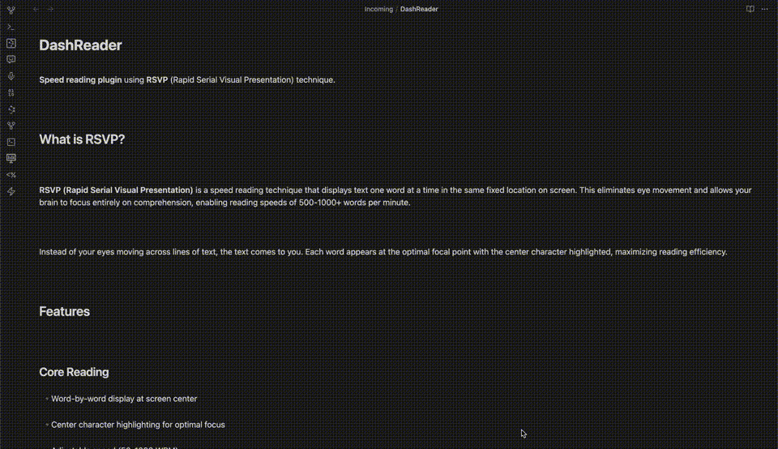

# DashReader

**Speed reading plugin for Obsidian** using **RSVP** (Rapid Serial Visual Presentation) technique.

> 🎯 **Project Status**: Stable • Production-ready • Obsidian Guidelines Compliant

## What is RSVP?

**RSVP (Rapid Serial Visual Presentation)** is a speed reading technique that displays text one word at a time in the same fixed location on screen. This eliminates eye movement and allows your brain to focus entirely on comprehension, enabling reading speeds of 500-1000+ words per minute.

Instead of your eyes moving across lines of text, the text comes to you. Each word appears at the optimal focal point with the center character highlighted, maximizing reading efficiency.

## Features

### Core Reading
- Word-by-word display at screen center
- Center character highlighting for optimal focus
- Adjustable speed (50-5000 WPM) - supports ultra-fast reading speeds
- Multi-word chunks (1-5 words at a time)
- Context display (surrounding words preview)

### Intelligent Pacing

- **Slow start** - Progressive speed increase over first 5 words
- **Smart micropauses** - Automatic pauses based on punctuation, word length, and document structure
- **Heading-aware pauses** - Longer pauses before headings (H1: 2.0x, H2: 1.8x, H3: 1.5x)
- **Progressive acceleration** - Gradual speed increase during session
- Default 400 WPM (range: 50-5000 WPM)
- All multipliers fully configurable in settings

### Markdown Support
- Parses markdown syntax (links, bold, italic, code)
- Reads code block content
- **Obsidian callouts support** - displays with icons (📝 note, 💡 tip, ⚠️ warning, etc.)
- **Proportional heading display** - H1 displayed 1.5x larger, H2 at 1.3x, H3 at 1.2x, etc.
- Visual separators before sections

### Contextual Navigation

- **Breadcrumb navigation** - Track position in document structure (H1 › H2 › H3)
- **Outline menu** (≡) - Full document structure with hierarchical view
- **Dropdown navigation** (▼) - Jump between same-level headings
- **New tab mode** (⤢) - Open in dedicated tab for fullscreen experience
- Click any heading to jump instantly
- Supports Obsidian callouts with icons

### Visual Minimap

- Vertical overview showing document structure and progress
- Heading markers with size hierarchy (H1 large, H2 medium, H3 small)
- Click markers to jump to any section
- Hover tooltips with heading text
- Minimal design, reveals on hover
- Toggle with toolbar button (👁)

### Smart Positioning

- Automatically starts from cursor position
- Tracks keyboard navigation in real-time
- Updates on cursor movement
- Accurate word position calculation

### Interface

- Adaptive dark/light mode following Obsidian theme
- Real-time progress bar and statistics
- Live WPM, time elapsed, estimated remaining time
- Distraction-free minimal design
- Toggleable controls and statistics panels
- Inline settings for quick adjustments

### Keyboard Shortcuts
- `Shift+Space`: Play/Pause
- `←`: Rewind 10 words
- `→`: Forward 10 words
- `↑`: Increase WPM (+25)
- `↓`: Decrease WPM (-25)
- `Esc`: Stop
- `s`: Toggle statistics

## Installation

### From Community Plugins (coming soon)
1. Open Settings → Community plugins
2. Browse and search for "DashReader"
3. Install and enable

### Manual Installation
1. Download `main.js`, `manifest.json`, `styles.css` from the latest release
2. Create folder `.obsidian/plugins/dashreader/` in your vault
3. Copy the downloaded files to this folder
4. Reload Obsidian
5. Enable DashReader in Settings → Community plugins

## Usage

### Quick Start
1. Click the ⚡ icon in the ribbon
2. Click anywhere in your note to set reading position
3. Press `Shift+Space` to start reading

### Other Methods
- **Command palette**: `Ctrl/Cmd + P` → "Open DashReader"
- **Context menu**: Right-click selected text → "Read with DashReader"
- **Auto-load**: Opens automatically when switching notes (configurable)

## Configuration

All settings available in `Settings → DashReader`:

- **Reading**: WPM speed (50-5000), chunk size, font settings
- **Slow Start**: Progressive speed ramp over first 5 words
- **Speed Acceleration**: Progressive acceleration with configurable duration and target WPM
- **Appearance**: Colors for highlight, text, and background
- **Context Display**: Show/hide surrounding words preview
- **Micropause**: Enable/disable with fully configurable multipliers for punctuation, headings, numbers, long words, and document structure
- **Navigation**: Show/hide breadcrumb and minimap, opacity controls
- **Auto-load**: Automatically load content on file switch or cursor change
- **Display Options**: Progress bar and statistics visibility

## Technology

Built with TypeScript using Obsidian Plugin API.

- **100% Obsidian Guidelines Compliant** - Passes all security and quality checks
- **Type-safe Architecture** - 99% type coverage, modular design
- **XSS Protection** - Safe DOM manipulation
- **Memory-safe** - Proper resource cleanup
- **Performance-optimized** - Efficient rendering and updates

## Roadmap

### Current Version (1.4.1) - Stable ✅

- Complete RSVP reading engine with intelligent pacing
- Breadcrumb navigation and visual minimap
- Obsidian callouts support
- Fully configurable micropause controls
- Ultra-fast reading support (up to 5000 WPM)
- 100% Obsidian guidelines compliant
- Production-ready with comprehensive refactoring

### Future Features 💡

- Reading statistics and progress tracking
- Multiple document reading queues
- Export reading sessions
- Custom reading profiles
- Browser extension version

## Contributing

Contributions are welcome! See [CONTRIBUTING.md](CONTRIBUTING.md) for development setup, guidelines, and architecture details.

## License

MIT License - See LICENSE file for details

## Author

**inattendu**

For questions or suggestions:
- GitHub Issues: [inattendu/dashreader/issues](https://github.com/inattendu/dashreader/issues)

---

**Read faster. Understand better.** ⚡
